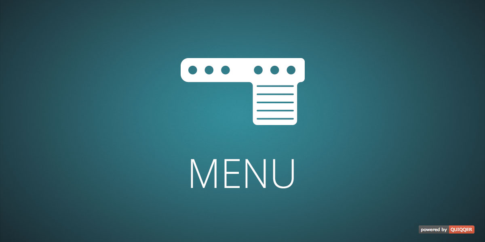
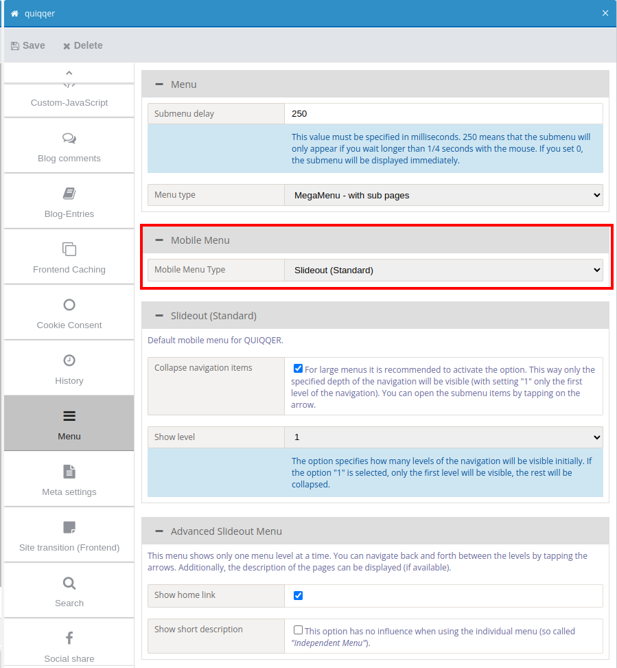
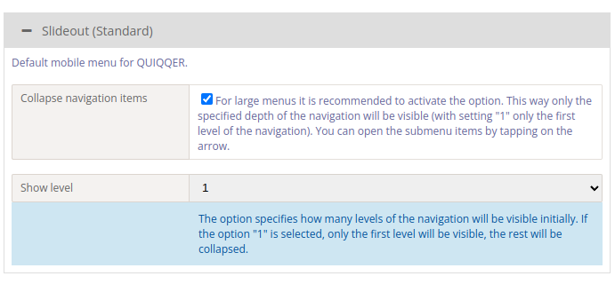
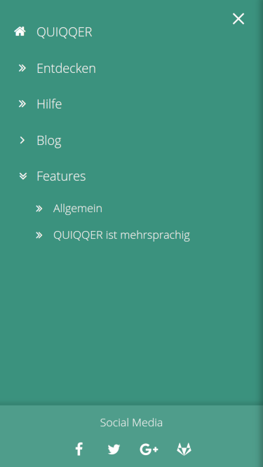
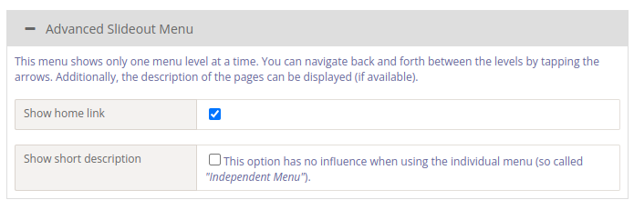
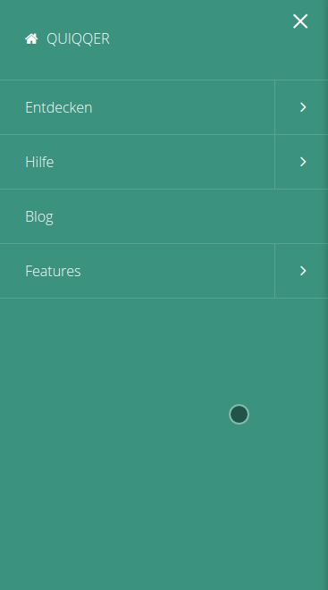

QUIQQER Menu
========

The Plugin menu provides various menu controls.

Package name:

    quiqqer/menu


Features
--------

- Mega Menu (mobile-fähig & Wechsel auf SlideOut)
    - besitzt verschiedene Anzeigearten
        - Mega Menu - mit Unterseiten
        - Mega Menu - Unterseiten mit Icons
        - Mega Menu - Unterseiten mit Icons, Bilder und Beschreibung
        - Mega Menu - Grosse Seitenbilder
        - Mega Menu - Grosse Seitenbilder
- Elastic Menu (mobile-fähig)
- SlideOut Menu (mobile-fähig)
- 2 Arten von Mobile-Menü:
  1. Slideout - standard mobiles Menü
  2. Slideout Advanced - Erweitertes Slideout Menü.


Installation
------------

Der Paketname ist: quiqqer/menu


Contribution
----------

- Issue Tracker: https://dev.quiqqer.com/quiqqer/package-menu/issues
- Source Code: https://dev.quiqqer.com/quiqqer/package-menu


Support
-------

Falls Sie Fehler gefunden, Wünsche oder Verbesserungsvorschläge haben,
können Sie uns gern per Mail an support@pcsg.de darüber informieren.  
Wir werden versuchen auf Ihre Wünsche einzugehen bzw. diese an die zuständigen Entwickler
des Projektes weiterleiten.


License
-------

MIT


Entwickler
--------

**MegaMenu Beispiel**


```php
<?php

$Menu = new \QUI\Menu\MegaMenu(array(
    'showStart' => true,
    'Project'   => $Site->getProject()
));

// logo hinzufügen
$Menu->appendHTML(
    '<a href="{url id=1}" class="page-header-menu-logo" title="Zur Startseite">
        getTemplateVariable('URL_TPL_DIR') . 'bin/images/logo.png"/>
    </a>'
);

```

```
    <div class="page-header-menu">
        <div class="grid-container">
            {$Menu->create()}
        </div>
    </div>
```

**Control Nutzung in Smarty**

```
{control control="\QUI\Menu\Elastic"}
{control control="\QUI\Menu\SlideOut"}
```

**Beispiel mit Einstellungen**

```
{control
    control="\QUI\Menu\DropDownMenu"
    Site=$Start
    icons=1
    showHomeIcon=1
}
```

```
{control control="\QUI\Menu\SlideOut"
    data-menu-right=10
    data-menu-top=15
    data-show-button-on-desktop=0
    data-qui-options-menu-width=400
    data-qui-options-menu-button=0
    data-qui-options-touch=0
    data-qui-options-buttonids=mobileMenu
}
```

**NavTabs and NavTabsVertical - auto open and scroll to element**

Every nav tab content has an url conform ID (title, it comes from brick entries).
You can use it to target and auto open this element. Simply place `#open_` before your title in the url.
The page will be scrolled to the element if it is not in viewport.

```html
<a href="www.example.com/subpage#open_myTarget">Open "myTarget" element</a>
```

# Menu project settings

You can choose between 2 mobile navigation: **Slideout** and **Slideout Advanced**.



## Slideout

This ist our basic mobile navigation. This menu shows per default all menu entries at once. 
If your navigation contains many sub-menu the mobile navigation may be large. User mey have to scroll this.

To solve this you can activate the option _"Collapse navigation items"_ and set _"Show level"_ to 1 
(or any other number you like).



If it activated you can open and close the sub-menus by clicking on the double arrow.



## Slideout advanced

This menu bases on Slideout but show the sub-menus differently. It shows only one menu level at once.
You can navigate back and forth between the levels by tapping the arrows. 
Additionally, you can activate the page description (if available).



Here you can see the menu in action:

